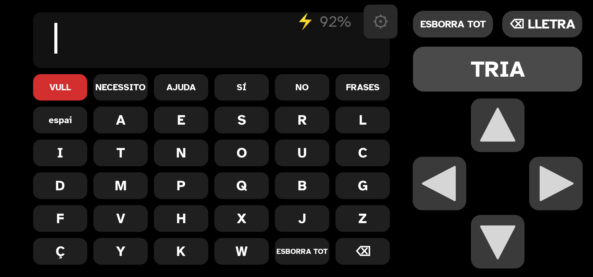
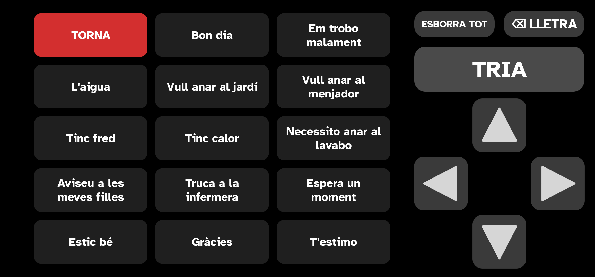

# Comunicador

An Android app that lets someone who cannot speak, and who has very little
movement left, write and be heard.

It was built for one woman with ALS who had lost the use of the keyboard app
she'd relied on for five years. It is being opened up because nothing about it
is specific to her: the same three or four decisions — how she selects, how fast,
how much a tremor should be forgiven — are the decisions everybody in this
situation has to make, and they are all settings.



**It works completely offline.** There is no internet permission in the app at
all, no account, no analytics, no cloud. What she writes stays on the device.

---

## Who this is for

Anyone who can reliably do **one** of these things, and not much else:

- press a single switch, button, or part of the screen
- touch a large target somewhere on the screen
- press four arrows and a confirm

If the person can still touch a normal keyboard accurately, they don't need
this app. If they can move an eye but nothing else, they need eye-gaze hardware
this app doesn't support. In between — and that "in between" lasts a long time
with ALS — this is the range it covers.

## The three ways to use it

All three write into the same grid and share every other setting. Switching
between them is one tap in settings, and nothing is lost by changing your mind
later; as someone's movement changes, the app is meant to move with them.

**Scanning** — the app moves a red highlight down the rows on its own. One press
picks a row, and the highlight then moves along that row. A second press writes
the letter. This needs the least movement of the three: one button, pressed
twice per letter, with no aiming at all. It's the right choice when reaching for
a particular spot on the screen is no longer possible.

**Arrows** — four large arrow buttons move the highlight, and a big TRIA/CHOOSE
button writes what it's on. Nothing moves on its own, so there is nothing to be
late for. This suits someone who can still aim at a large target and finds
waiting for the scan frustrating.


**Direct touch** — she touches the letter she wants. The simplest to explain and
the most movement required.

## Phrases

A second screen of whole sentences, spoken aloud when chosen — the things that
are needed quickly and shouldn't have to be spelled out. The shipped list is a
starting point and is meant to be replaced with the person's own.



## Getting it onto a device

**Requirements:** Android 8.0 or newer. Any phone or tablet. It locks to
landscape.

### Build it yourself

You need [Android Studio](https://developer.android.com/studio) — that's the
only prerequisite; it brings its own Java and Android SDK.

```bash
git clone https://github.com/Dracvar06/MerceV2.git
```

Open the folder in Android Studio, plug in the device, and press Run. Or from a
terminal, with the device connected and USB debugging on:

```bash
./gradlew installDebug
```

If Gradle complains it cannot find Java, point it at the copy inside Android
Studio:

```bash
export JAVA_HOME="/Applications/Android Studio.app/Contents/jbr/Contents/Home"
```

(On Windows and Linux the path differs; it is the `jbr` folder inside the
Android Studio install.)

To build a signed release for someone else's device, see
[docs/PUBLISHING.md](docs/PUBLISHING.md), which covers the signing key and why
losing it is unrecoverable.

## Setting it up for someone

**Start with the walkthrough.** Open settings — the small ⚙ in the top corner —
and press **COM FUNCIONA / HOW IT WORKS**. It is ten pages, written for the
helper rather than for the person using the app, and it exists because of a real
failure: the app was once taken to her by somebody who had only had it described
to them, who explained it wrong, and it was judged not to work when it worked
fine.

Two things in it are worth knowing before you read anything else, because
almost everybody gets them wrong:

- **The letters are not buttons** in scanning and arrow modes. Touching a letter
  does nothing. The highlight is what selects.
- **In scanning mode the two halves of the screen are invisible buttons.** The
  right half writes, the left half undoes. There is nothing drawn to show this,
  deliberately — anything drawn over the grid covers letters permanently in
  order to explain something once.

### The settings that actually matter

Most of the screen can be left alone. These are the ones worth thinking about:

| Setting | Why it matters |
|---|---|
| **How she writes** | Scanning, arrows, or direct touch. Everything else is a detail of whichever you pick. |
| **Scanning speed** | The single most important number in the app. Too fast and she misses letters; too slow and a sentence takes all afternoon. Start slow and speed up over days, not minutes. |
| **Extra time on the first letter** | Entering a row and immediately having to decide is the hardest moment in scanning. This buys a beat. |
| **Minimum time between presses** | Swallows a tremor that presses twice. Raise it if single presses are registering as doubles. |
| **Ignore tremors** | Stronger version of the above: a burst of presses counts once, however long it lasts. |
| **Locked mode** | Pins the app to the screen so it cannot be left by accident. Turn it off here to exit. |

### Switches and gamepads

A physical switch usually reaches the device as a Bluetooth keyboard or gamepad
button. Settings has **COMPROVA ELS POLSADORS / CHECK THE SWITCHES**, which shows the
raw code behind every press, and lets you bind whichever buttons the hardware
actually sends to *write* and to *undo*. Several buttons can be bound to each.

There is an ESP32 firmware for a simple two-switch box in
[`hardware/`](hardware/), if you want to build one.

## Languages

Catalan, English and Spanish, each with its own word prediction model, its own
letter layout ordered by how common the letters are in that language, its own
phrases, and its own walkthrough. Changing the language changes all of it.

Adding a language means adding one `Language` entry and building a model with
`tools/build_model.py`. Contributions of new languages are very welcome — it is
the single highest-value thing anyone could add.

## How it is built

Kotlin and Jetpack Compose, four layers, the first three with zero Android
imports so they can be tested on the JVM:

```
scan/         the scanning state machine and the free cursor — pure logic
input/        debounce and press filtering — pure logic
prediction/   n-gram word prediction, and what it learns from her — pure logic
ui/           Compose screens, settings, persistence, speech
```

Around 250 unit tests, run with `./gradlew test`. They cover the machine, not
the pixels: the things that must not break are the ones that would be found out
on somebody who cannot tell you what went wrong.

A few principles the code is held to, all of them learned the hard way and
written up in [docs/ROADMAP.md](docs/ROADMAP.md):

- **The scan must never stutter.** Nothing slow runs on the thread driving the
  highlight.
- **No dead ends.** Every screen can be left using only the switches. Settings
  is the one screen the scan cannot reach, and either switch closes it.
- **New ways of working are added beside the old ones, never instead of them.**
  Every input mode, arrow arrangement and layout this app has ever had is still
  in it and still reachable, because what stopped working for one person is
  exactly what works for the next.
- **No dead space in anything she has to hit.** The gaps between the arrows
  belong to the nearest arrow. A hand that cannot be placed precisely needs that
  more than it needs tidy edges.

## Contributing

Issues and pull requests are welcome. Two requests:

1. **Don't remove an option to add one.** See the principle above.
2. **Say who it's for.** "This helps someone who can do X but not Y" is worth
   more than a description of the change, because that's the thing nobody can
   work out from the diff.

If you are using this with somebody, and something about it does not fit them,
that is the most useful issue you can open — even with no idea what the fix
would be.

## Licence and credits

Licensed under the **GNU General Public License v3.0**. See [LICENSE](LICENSE).

Set in **Atkinson Hyperlegible**, drawn by the Braille Institute for readers
with low vision, under the SIL Open Font License — see
[OFL-AtkinsonHyperlegible.txt](OFL-AtkinsonHyperlegible.txt). Other third-party
components are listed in
[THIRD-PARTY-NOTICES.md](THIRD-PARTY-NOTICES.md).

Built for Mercè.
